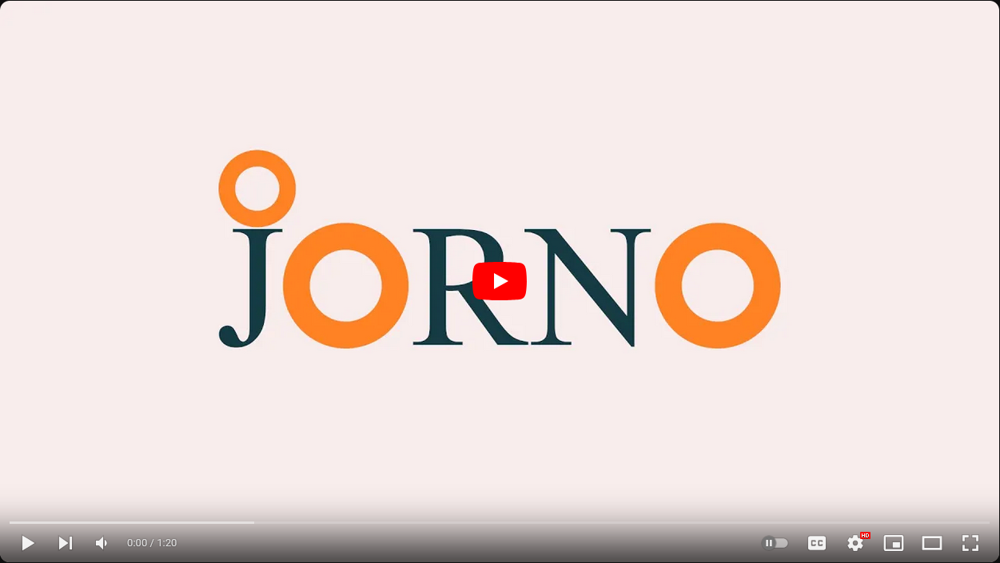
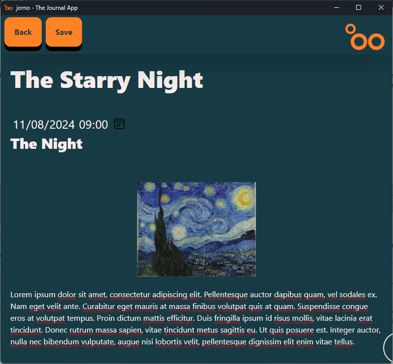
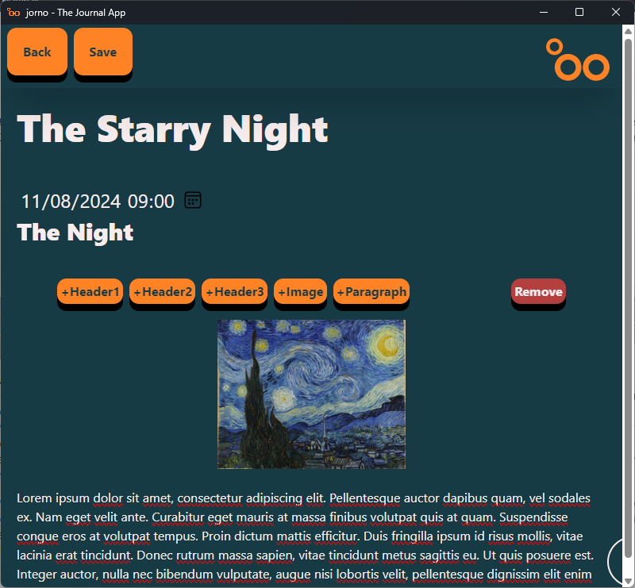
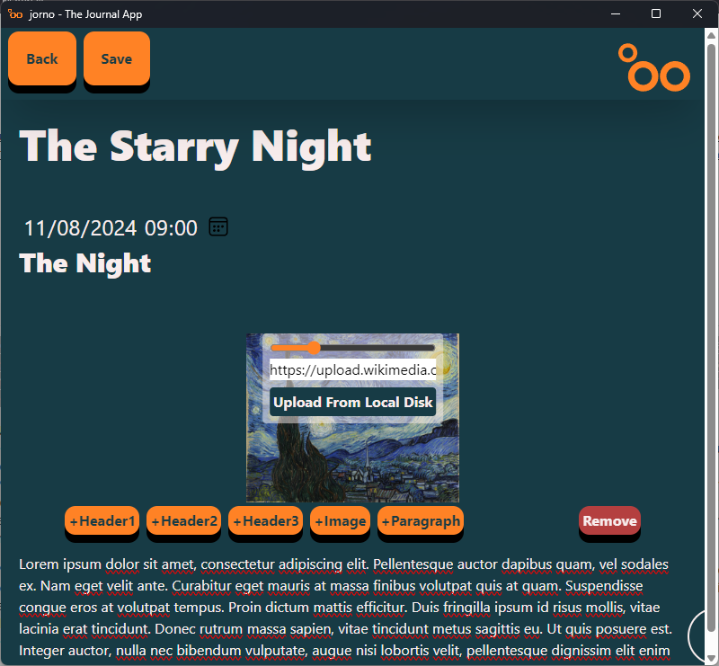
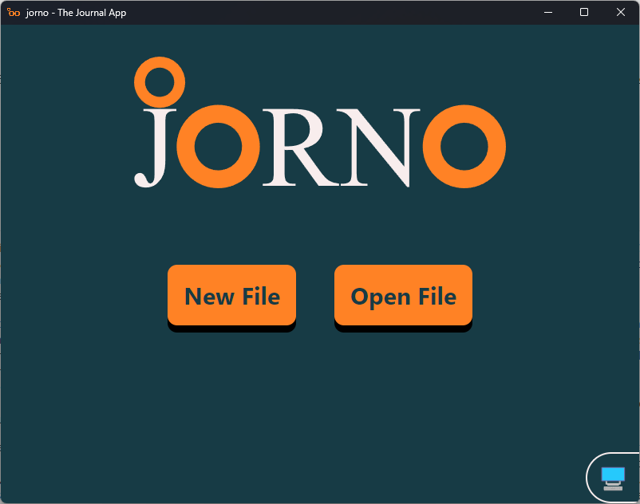
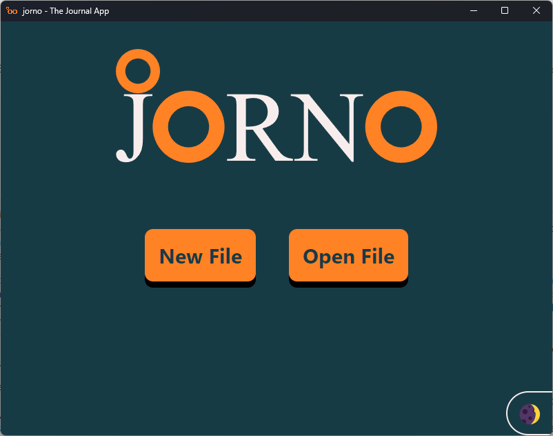
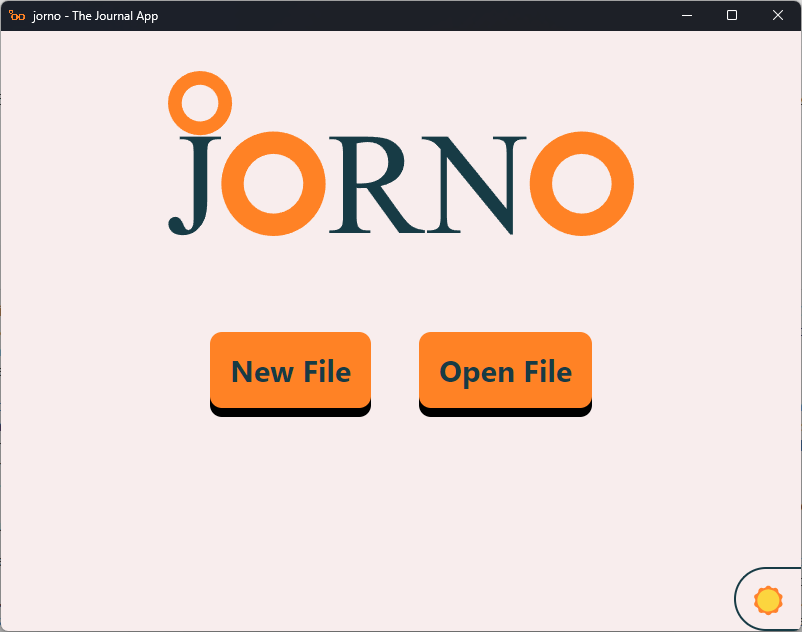
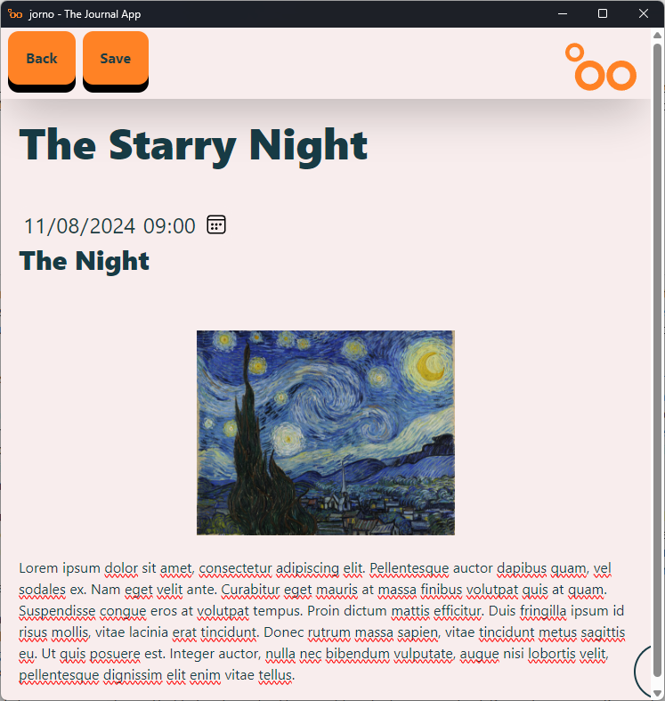

# jorno - The Journaling App

Built with [Tauri](https://tauri.app/), [Svelte](https://svelte.dev/), [Vite](https://vitejs.dev/), and [Tailwind CSS](https://tailwindcss.com/).

## Demonstrations
### Video

### Images
#### Editing

View of the window where a jorno file can be edited

View of the window when a section is hovered, showing the buttons to add more sections

View of the window when an image is hovered, showing a zoom slider, a URL input and a upload from disk options

#### Theme Modes
The theme mode can be changed by hovering and clicking on the peeking button on the bottom right corner.

View of the main menu when the theme mode is based on the system preference

View of the main menu when the dark mode is used

View of the main menu when the light mode is used

View of a jorno file being edited in light mode

## Building from source
1. [Install Tauri's prerequisites](https://tauri.app/v1/guides/getting-started/prerequisites)
2. Install the npm packages using `npm i`
3. Run in developer mode `npx tauri dev` or build the bundle using `npx tauri build`. 

### Known bugs
Windows Defender and [VirusTotal](https://www.virustotal.com) will flag the (`.msi`) bundle and its installation file as a threat containing inter alia a Trojan `Trojan:Script/Wacatac.B!ml`. The issue is tracked in tauri-apps/tauri#2486 on Tauri's repository.